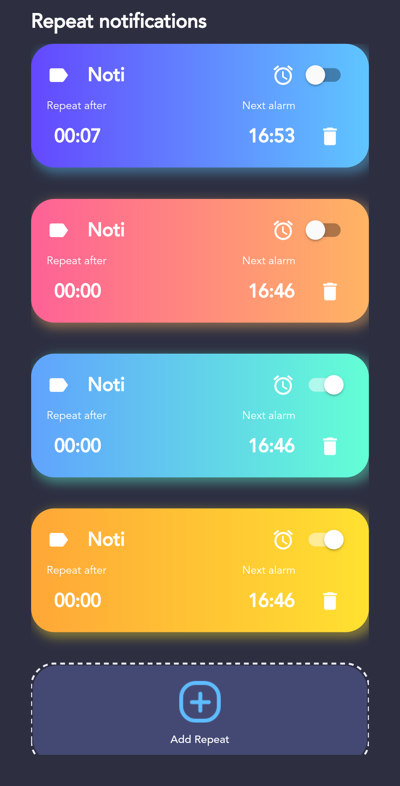

# Repeat notifications
Create and repeat notifications after a period of time.\

## Features
- Unlimitedly create reminders.
- Can change the title and duration after creating by clicking on them.
- Can reorder just by dragging things where you want them to go. 
- Press holds the time under the "Next alarm" to display the time to the next alarm .

## Supports
- Android (tested in version [11,10,7,5.1]).

## References
- Thanks to **CodeX** to create a beautiful interface. [link](https://www.youtube.com/watch?v=tKtYfuuVHlA&list=PL3wGb9_yWsvKfjFgXntI_uxUV7R0L0Act&index=4)
- Thanks **Sneha Saj** to create an easy to understand guide about Reorderable ListView on Medium. [link](https://medium.com/@snehasaj1999/flutter-reorderable-listview-sqflite-instance-165183037d7a)
- Thanks **fahidsarker-CC** to fix issues android_alarm_manager_plus not working. [link](https://github.com/fluttercommunity/plus_plugins/issues/317#issuecomment-869099163)
- Thanks ***[Tuan Do Minh](https://github.com/tuan243)*** to help me push app to google play store.
